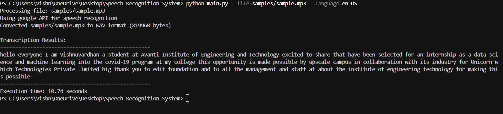

# Speech Recognition System

*COMPANY*: CODTECH IT SOLUTIONS

*NAME*: PALADUGU VISHNU VARDHAN

*INTERN ID*: CODF32

*DOMAIN*: ARTIFICIAL INTELLIGENCE 

*DURATION*: 4 WEEEKS

*MENTOR*: NEELA SANTOSH KUMAR

---


A simple speech-to-text system that transcribes audio files using pre-trained models via the SpeechRecognition library.

## 📋 Table of Contents
- [Features](#features)
- [Installation](#installation)
- [Usage](#usage)
- [Project Structure](#project-structure)
- [Dependencies](#dependencies)
- [License](#license)

## ✨ Features

- Transcribe audio files to text
- Support for multiple audio formats (.wav, .mp3, etc.)
- Uses Google's Speech Recognition API
- Simple command-line interface
- Optional offline recognition with CMU Sphinx

## 🔧 Installation

### Prerequisites
- Python 3.7+
- FFmpeg (for audio conversion)

### Setup Instructions

1. **Clone this repository:**
   ```bash
   git clone https://github.com/Ver-er/Speech-Recognition-System.git
   cd Speech-Recognition-System
   ```

2. **Install required dependencies:**
   ```bash
   pip install -r requirements.txt
   ```

3. **Install FFmpeg:**
   - **Windows:** Download from [ffmpeg.org](https://ffmpeg.org/download.html)
   - **macOS:** `brew install ffmpeg`
   - **Linux:** `sudo apt install ffmpeg` or equivalent for your distribution

4. **Configure FFmpeg path:**
   - Open `audio_handler.py`
   - Set the `FFMPEG_PATH` variable to point to your FFmpeg executable
   - Example: `FFMPEG_PATH = r"C:\ffmpeg\bin\ffmpeg.exe"`

### Troubleshooting PyAudio Installation

If you encounter issues installing PyAudio:

- **Windows:** 
  ```bash
  pip install pipwin
  pipwin install pyaudio
  ```
- **macOS:** 
  ```bash
  brew install portaudio
  pip install pyaudio
  ```
- **Linux:** 
  ```bash
  sudo apt-get install python3-pyaudio
  ```

## 🚀 Usage

### Basic Command

```bash
python main.py --file samples/your_audio_file.mp3 --language en-US
```

### Available Options

| Option | Description | Default |
| ------ | ----------- | ------- |
| `--file` | Path to the audio file | *Required* |
| `--language` | Language code for recognition | `en-US` |
| `--api` | Recognition API to use (google, sphinx) | `google` |

## 📁 Project Structure

```
speech-recognition-system/
├── main.py                 # Command-line interface
├── audio_handler.py        # Audio loading and processing
├── transcriber.py          # Speech recognition logic
├── requirements.txt        # Project dependencies
└── samples/                # Example audio files
```

## 📚 Dependencies

- [SpeechRecognition](https://pypi.org/project/SpeechRecognition/) - Speech recognition API
- [PyAudio](https://pypi.org/project/PyAudio/) - Audio I/O
- [pocketsphinx](https://pypi.org/project/pocketsphinx/) - For offline recognition
- FFmpeg - External system dependency for audio conversion

## 📝 License

[MIT](LICENSE)

## 📊 Sample Output

